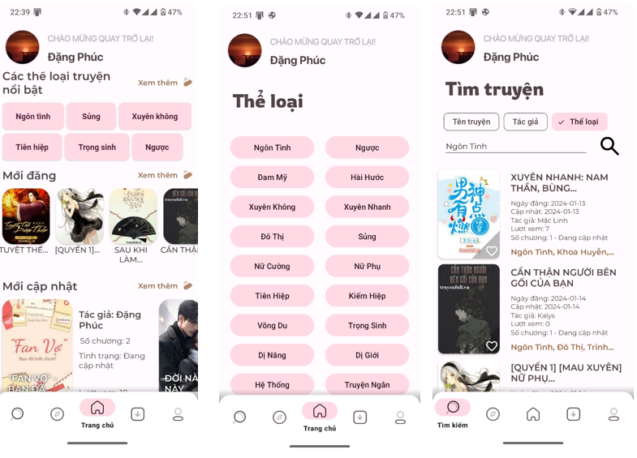
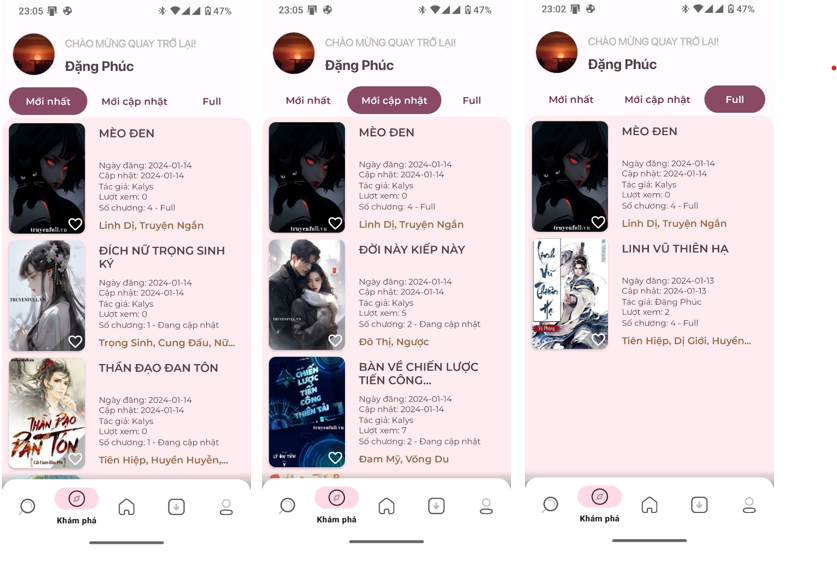
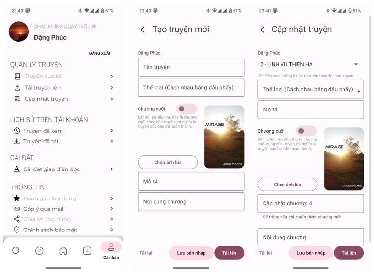
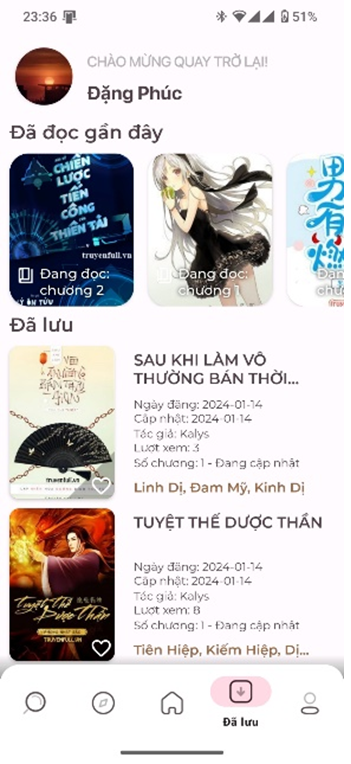
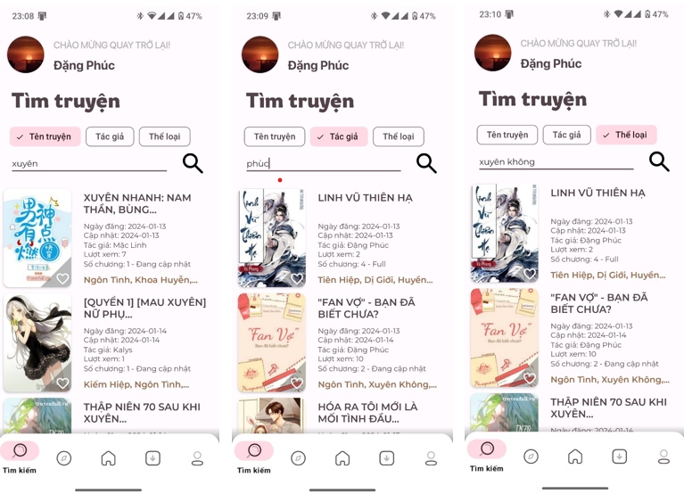
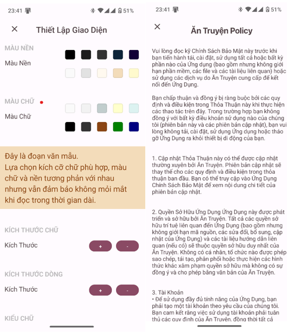
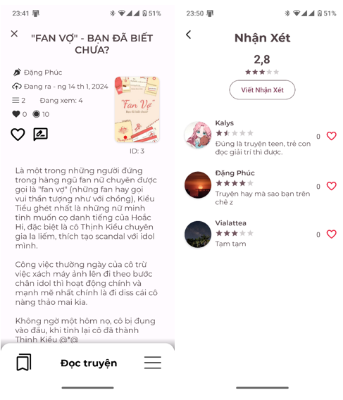
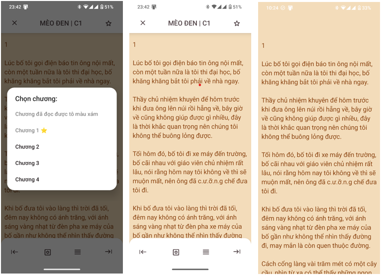

# Story Reading Android App

This is a simple Android Java project for a story reading app. The app allows users to read and discover various stories on their Android devices.

## Features

- Read stories in a user-friendly interface
- Bookmark favorite stories for quick access
- Adjust font size and background color for comfortable reading
- Browse and search for stories with a powerful search tool that does not require exact matches.
- Utilizes the latest Google's design language, Material 3, along with dynamic color for a seamless user experience.

## Screenshots
*Home Screen*

*Discovery Screen*

*Profile Screen*

*Recent Screen*

*Search Screen*

*Settings and Policy Screen*

*Story Information Screen*

*Story Reading Screen*

## Installation

1. Clone the repository: `git clone https://github.com/bpminhdang/TruyenChu.git`
2. Open the project in Android Studio.
3. Build and run the app on an Android device or emulator.

## Technologies Used

- Java programming language.
- Android Studio IDE.
- Firebase Realtime Database for storing stories and bookmarks.
- Firebase Storage for storing story covers and user profile pictures.
- Firebase Authentication for user authentication.

## Contributing

Contributions are welcome! If you find any bugs or have suggestions for improvements, please open an issue or submit a pull request.

## License

This project is licensed under the [MIT License](LICENSE).
